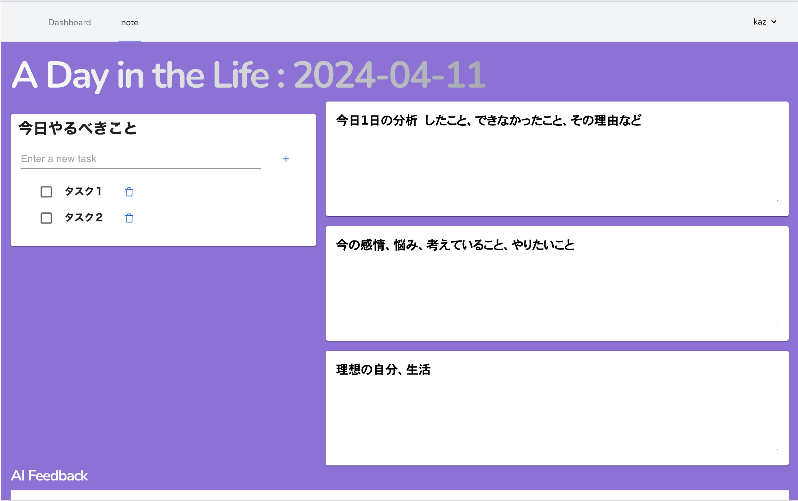

## サービス概要
このサービスは、日々の自己反省と成長をサポートするために、パーソナライズされたジャーナル体験を提供します。このプラットフォームは、日々の出来事を分析すること、自分の感情や考えを整理すること、そして自分が目指す理想の生活や自己像について考えることを中心に構成されており、ユーザーが自己理解を深める手助けをします。また、AIフィードバック機能を搭載し、ユーザーの入力に基づくパーソナライズされたアドバイスと具体的な行動提案を提供します。

## 使い方

### 1. register or sign up ユーザー登録ボタンを押す

### 2. ログイン画面　

### 3. /dashboard 画面
ここではカレンダーの日付の枠を押すとその日付のジャーナリングページに飛びます。
またnoteを押すと今日のジャーナリングページに飛ぶことができます。
右上のユーザー名が書かれたボタンからログアウト可能です。

### 4. ジャーナリングページ
左には簡単なtodoリストジャーナリングを行う際に参考にできます。
右はカスタマイズされたジャーナリングn湯力ランがあります。

ジャーナリング記入欄をタップすると入力画面が現れジャーナル記入後、左下のDoneボタンを入力するとデータが挿入されます。

GET FEEDBACK ボタンを押すとその日に書いたジャーナリングに対するAIからのフィードバックがもらえます。

## サービスを開発した背景
私がジャーナリングサービスを開発した背景には、まずどのようなサービスを作りたいかと考えたとき、自分の習慣に関わるサービスにしようと考えました。そこで今自分が行なっているこの自己流のジャーナリングプロセスを一般化し、技術を活用してより多くの人に届けられる形にすることで、自己成長を目指す人々の強力なサポートツールとなることを目指しました。さらに、AI技術を組み込むことで、ユーザーの入力に基づいたパーソナライズされたフィードバックを提供し、私たちの成長プロセスをより効果的にサポートすることを目指しました。

## 使用技術一覧

  <!-- フロントエンドのフレームワーク一覧 -->
  
  
  <!-- バックエンドのフレームワーク一覧 -->
  
  <!-- バックエンドの言語一覧 -->
  
  <!-- ミドルウェア一覧 -->
  
  
  <!-- インフラ一覧 -->
  

